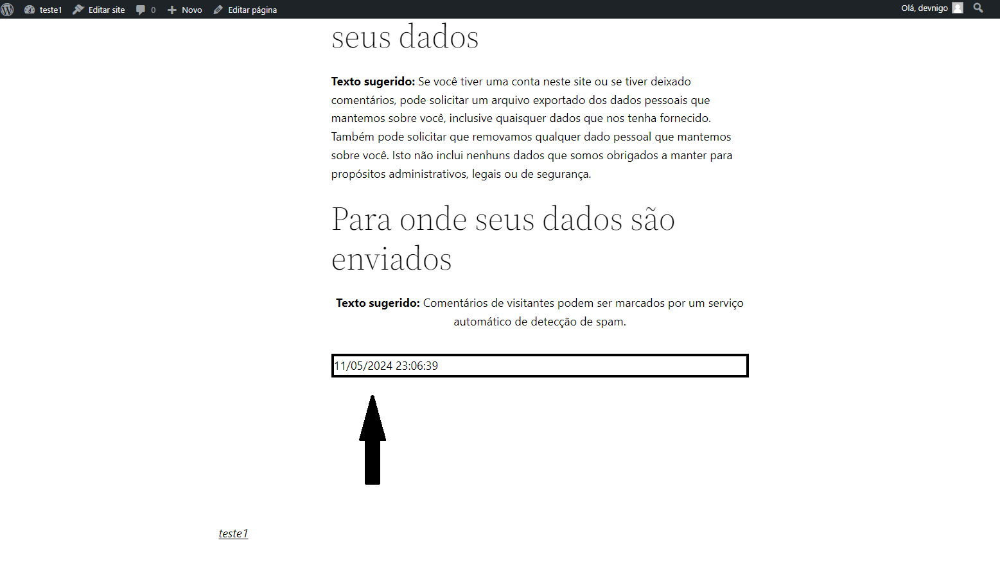

# FlyerDataLog

Um plugin simples para WordPress que exibe a data e hora atuais no fuso horário GMT-3 (Brasília).

## Exemplo de Uso

Depois de ativar o plugin, você pode usar o shortcode `[flyerdatelog]` em suas postagens, páginas ou widgets para exibir a data e hora atuais no formato "dia/mês/ano hora:minuto:segundo" no fuso horário GMT-3 (Brasília).

Aqui está como você pode adicionar o shortcode em uma postagem:

1. Abra a postagem desejada no painel de administração do WordPress.
2. Cole o shortcode `[flyerdatelog]` no conteúdo da postagem.
3. Atualize ou publique a postagem.

Em seguida, a data e hora atuais serão exibidas onde você colocou o shortcode.

